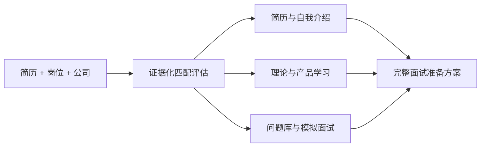

# 大客户销售校招面试教练

一个面向校招生和早期职业候选人的中文 Codex 技能：根据你的真实简历、目标岗位和公司背景，生成针对性面试准备方案。



## 它能做什么

- 评估简历与目标岗位的匹配度，并说明评分依据；
- 在不编造经历和数字的前提下修改简历；
- 生成 30、60、90 秒岗位化中文自我介绍；
- 研究目标公司的业务、产品、客户、竞品和常见异议；
- 根据岗位选择销售理论，而不是机械罗列书单；
- 生成学习计划、面试问题库、真实故事库和模拟面试；
- 支持信息通信、企业软件、制造、金融、医疗和政府行业；
- 使用合成匿名案例检查评分漂移和事实错误。

## 工作流程



## 使用示例

```text
请使用 $enterprise-sales-interview-coach 分析我的简历和目标客户经理岗位。
先评估匹配度并修改简历，再研究相关产品和客户场景，
生成 60 秒中文自我介绍、7 天学习计划和模拟面试问题。
所有内容只能使用我的真实经历。
```

## 你会得到

1. 岗位匹配结论和证据矩阵；
2. 可直接使用的简历修改稿；
3. 岗位化中文自我介绍；
4. 公司与产品知识卡；
5. 销售理论学习重点；
6. 三天、七天或十四天学习计划；
7. 面试问题、回答结构和高质量反问；
8. 风险、待补充事实和资料来源。

## 下载技能

下载并解压 [完整技能包](imgs/enterprise-sales-interview-coach-skill.zip)，将其中的 `enterprise-sales-interview-coach` 文件夹复制到 Codex skills 目录。

## 重要原则

- 不虚构候选人经历、数字、客户或合同；
- 不把匹配分数解释为录用概率；
- 不使用学校层级、性别、年龄、婚育等无关信息评分；
- 不虚构公司产品、价格和内部组织；
- 不公开真实简历、客户机密和面试隐私；
- 公司动态信息必须使用最新公开来源核实。

本项目采用 MIT 许可。技能用于提高准备质量，不承诺保证录用。
